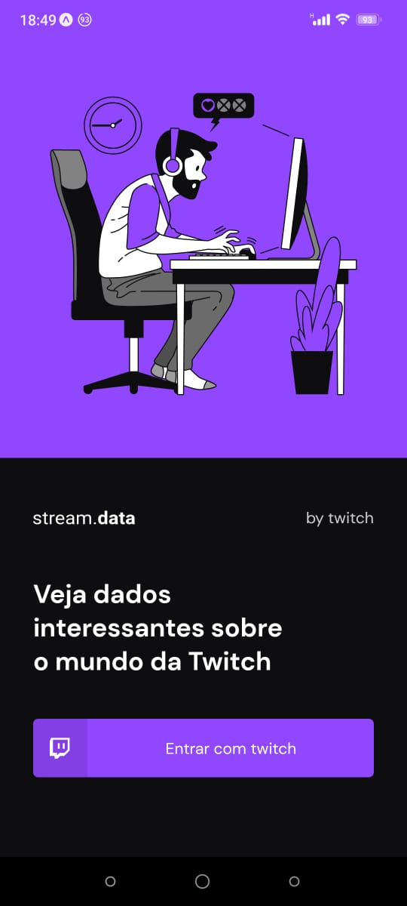
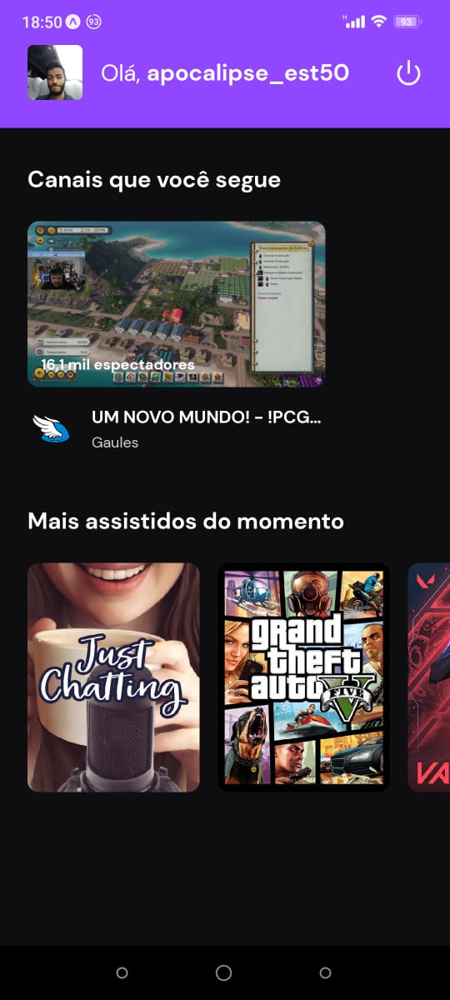

# Desafio: Login Social com a Twitch

Neste desafio foi criado uma aplicação para treinar o que aprendeu até agora no React Native.
Essa será uma aplicação de login social com a Twitch, onde você vai treinar um pouco mais sobre autenticação e Context API.

## :dart: Implementação das funcionalidades
- [x] Login Social com Twitch;
  - [x] SignIn e SignOut.
- [x] Context API para gerenciamento da autenticação do usuário;
- [x] Consumo da API da Twitch;

## :camera: Screenshots da aplicação

  
  

## :man_technologist: Tecnologias
- [x] React;
- [x] React Native;
- [x] OAuth2;
- [x] AuthSession;
- [x] Hooks;